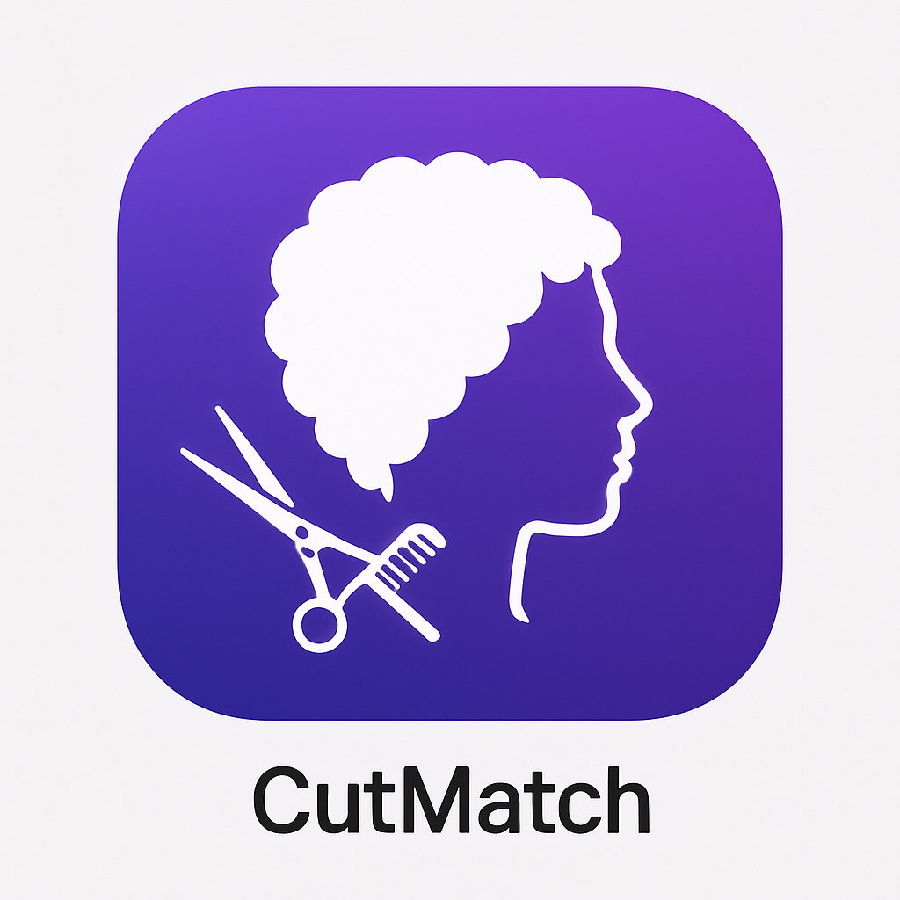

# CutMatch - Style Before You Snip

**A global, AI-powered mobile app that helps users discover their ideal hairstyle through inclusive, culturally-aware style recommendations.**



## 🎯 Project Overview

CutMatch is more than a hairstyle app – it is a mirror into how people feel, express, and grow. It helps users find inspiration, honor their roots, and share moments of transformation.

### Core Mission
- **Style Discovery**: AI-powered hairstyle recommendations based on face shape, hair type, and cultural preferences
- **Global Inclusivity**: Supporting all hair textures and cultural backgrounds
- **Self-Expression**: Empowering users to explore and express their identity through hair
- **Confidence Building**: Helping users visualize styles before salon visits

## ✨ Key Features

### 🤳 Photo Analysis & AI Recommendations
- Upload or capture photos for instant style analysis
- AI-powered suggestions based on face shape, hair type, and cultural context
- 15+ diverse hairstyle categories including protective styles, fades, braids, and more
- Confidence scoring for each recommendation

### 🌍 Global & Inclusive Design
- **Multilingual Support**: English, Spanish, French, Swahili
- **Cultural Awareness**: Styles for African, Asian, Latino, Middle Eastern, and all backgrounds
- **Hair Type Diversity**: Straight, wavy, curly, coily, kinky textures
- **Gender Inclusivity**: Male, female, and gender-neutral options

### 💝 Personalization & Favorites
- Save favorite styles with personal notes
- Mood-based filtering (professional, casual, edgy, romantic)
- User profile with skin tone and hair type preferences
- Daily affirmations feature (optional)

### 🔗 Sharing & Salon Integration
- Generate shareable links for each style
- Print QR codes for salon visits with styling instructions
- Share collections with friends and stylists
- No booking system - focused on style discovery

### 📊 Analytics & Insights
- Google Analytics 4 integration for user behavior tracking
- Screen view and action tracking
- Error monitoring and performance insights

## 🏗️ Technical Architecture

### Frontend (React Native + Expo)
```
frontend/
├── src/
│   ├── screens/          # 8 main app screens
│   ├── components/       # Reusable UI components
│   ├── utils/           # Utilities (i18n, analytics, mock AI)
│   ├── locales/         # Translation files
│   └── assets/          # Images and icons
├── App.js               # Main app entry point
├── app.json            # Expo configuration
└── package.json        # Dependencies
```

### Backend (Supabase)
```
backend/
├── supabase/
│   ├── schema.sql       # Database schema with RLS
│   └── config.toml      # Supabase configuration
```

### Assets & Branding
```
assets/
└── branding/
    ├── app-icon-purple.png     # Primary app icon
    ├── app-icon-gold.png       # Premium variant
    ├── ui-mockup-1.png         # UI reference
    └── ui-mockup-2.png         # UI reference
```

## 🚀 Quick Start

### Prerequisites
- Node.js 18+ and npm
- Expo CLI (`npm install -g @expo/cli`)
- Supabase account
- Google Analytics 4 property (optional)

### Installation

1. **Clone and Install**
   ```bash
   cd frontend
   npm install
   ```

2. **Environment Setup**
   ```bash
   cp .env.example .env
   # Edit .env with your configuration
   ```

3. **Start Development Server**
   ```bash
   npm start
   ```

4. **Test on Device/Simulator**
   - Scan QR code with Expo Go (Android/iOS)
   - Press 'w' for web version
   - Press 'a' for Android emulator
   - Press 'i' for iOS simulator

## ⚙️ Configuration

### Required Environment Variables

```bash
# Supabase Configuration
EXPO_PUBLIC_SUPABASE_URL=https://your-project.supabase.co
EXPO_PUBLIC_SUPABASE_ANON_KEY=your-anon-key

# Google Analytics (Optional)
EXPO_PUBLIC_ENABLE_ANALYTICS=true
EXPO_PUBLIC_GA4_MEASUREMENT_ID=G-XXXXXXXXXX

# AdMob Configuration (Optional)
EXPO_PUBLIC_ENABLE_ADS=true
EXPO_PUBLIC_ADMOB_TEST_MODE=true
```

### Supabase Setup

1. Create a new Supabase project
2. Run the SQL schema from `backend/supabase/schema.sql`
3. Configure Row Level Security policies
4. Get your project URL and anon key from Settings > API

### Google Analytics Setup

1. Create a GA4 property
2. Get your Measurement ID
3. Configure custom events for style interactions

## 📱 App Screens

1. **Splash Screen** - Brand introduction with manifesto
2. **Upload Screen** - Photo capture with helpful tips
3. **Analyzing Screen** - AI processing with progress indicator
4. **Suggestions Screen** - Style recommendations with filtering
5. **Style Detail Screen** - Detailed view with sharing options
6. **Favorites Screen** - Saved styles with personal notes
7. **Profile Screen** - User preferences and cultural settings
8. **Settings Screen** - Language, privacy, and app preferences

## 🎨 Design System

### Color Palette
- **Primary Purple**: #6A0DAD
- **Secondary Gold**: #FFD700
- **Background**: #FFFFFF
- **Text**: #333333
- **Accent**: #F0F0F0

### Typography
- **Headers**: System font, bold
- **Body**: System font, regular
- **Captions**: System font, light

## 🌐 Deployment

### Mobile App Deployment (Expo/EAS)

1. **Configure app.json**
   ```json
   {
     "expo": {
       "name": "CutMatch",
       "slug": "cutmatch",
       "version": "1.0.0",
       "platforms": ["ios", "android", "web"]
     }
   }
   ```

2. **Build for App Stores**
   ```bash
   # Install EAS CLI
   npm install -g eas-cli
   
   # Configure builds
   eas build:configure
   
   # Build for iOS
   eas build --platform ios
   
   # Build for Android
   eas build --platform android
   ```

3. **Submit to Stores**
   ```bash
   # Submit to App Store
   eas submit --platform ios
   
   # Submit to Play Store
   eas submit --platform android
   ```

### Backend Deployment (Supabase)

1. **Database Setup**
   - Import schema from `backend/supabase/schema.sql`
   - Configure RLS policies
   - Set up authentication providers

2. **Environment Configuration**
   - Update production environment variables
   - Configure CORS settings
   - Set up monitoring and alerts

## 🔧 Development

### Available Scripts

```bash
# Start development server
npm start

# Start with cleared cache
npm start --clear

# Run on specific platform
npm run android
npm run ios
npm run web

# Build for production
npm run build

# Run tests
npm test
```

### Code Structure

- **Screens**: Main app screens with navigation
- **Components**: Reusable UI components
- **Utils**: Helper functions and services
- **Locales**: Translation files for i18n
- **Assets**: Images, icons, and media files

## 🐛 Troubleshooting

### Common Issues

1. **Web Version Blank Screen**
   - Check i18n configuration
   - Verify environment variables
   - Clear Metro cache: `npm start --clear`

2. **Login Spinner Hang**
   - Check Supabase configuration
   - Verify authentication setup
   - Check network connectivity

3. **Analytics Not Working**
   - Verify GA4 Measurement ID
   - Check environment variables
   - Ensure analytics are enabled

4. **Ads Not Showing**
   - Check AdMob configuration
   - Verify test mode settings
   - Ensure ads are enabled for environment

### Debug Mode

Enable debug logging by setting:
```bash
EXPO_PUBLIC_DEBUG_MODE=true
```

## 📊 Analytics & Monitoring

### Tracked Events
- App launches and screen views
- Style recommendations and selections
- Sharing and favorites actions
- User preferences and settings changes
- Error occurrences and performance metrics

### Performance Monitoring
- App startup time
- Screen transition performance
- API response times
- Error rates and crash reports

## 🔒 Security & Privacy

### Data Protection
- Row Level Security (RLS) on all database tables
- Encrypted data transmission (HTTPS/WSS)
- Minimal data collection with user consent
- GDPR and CCPA compliance ready

### Privacy Features
- Optional analytics tracking
- Local data storage for preferences
- User-controlled data deletion
- Transparent privacy policy

## 🌟 Future Enhancements

### Phase 2 Features
- Real AI model integration
- Advanced face shape detection
- Augmented reality try-on
- Social features and community
- Professional stylist network

### Monetization Opportunities
- Premium subscription tiers
- Affiliate product recommendations
- Sponsored style content
- Professional stylist partnerships

## 🤝 Contributing

### Development Guidelines
- Follow React Native best practices
- Use TypeScript for type safety
- Implement comprehensive testing
- Follow accessibility guidelines
- Maintain cultural sensitivity

### Code Style
- ESLint configuration included
- Prettier for code formatting
- Conventional commit messages
- Pull request templates

## 📄 License

This project is proprietary software owned by Visnec Technologies. All rights reserved.

## 📞 Support

For technical support or questions:
- Email: support@cutmatch.app
- Documentation: https://docs.cutmatch.app
- Community: https://community.cutmatch.app

---

**CutMatch - Style Before You Snip** 💇‍♀️✨

*Empowering self-expression through inclusive hairstyle discovery*

