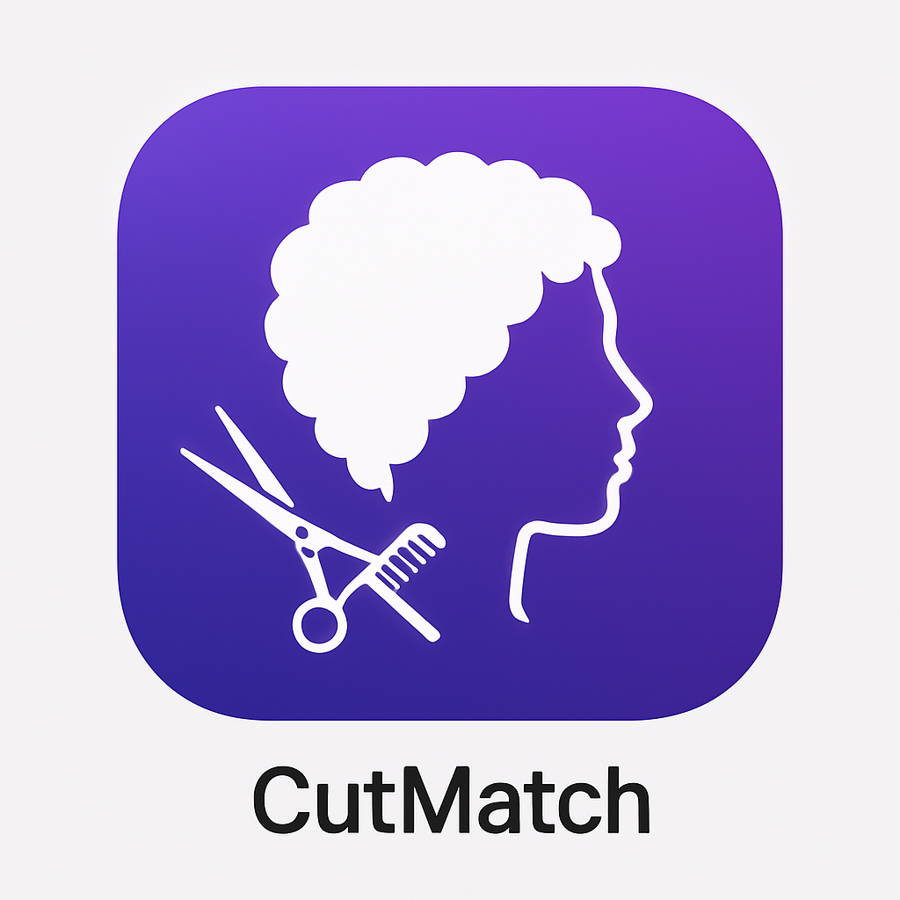

# CutMatch - Style Before You Snip

**An AI-powered mobile app that helps users discover hairstyles that fit their face and identity, focusing on style visualization and self-expression.**



## 🌟 Project Overview

CutMatch is a global, mobile-first AI-powered app that helps users discover their ideal hairstyle. Users take or upload a photo, and the app suggests 3–5 personalized styles based on face shape, hair type, and cultural preferences. The experience is inclusive, multilingual, and focused on beauty, wellness, and expression.

### 🎯 Core Objective
Build an AI-based mobile app that helps users discover hairstyles that fit their face and identity before going to the salon. Not a booking app — this is a style visualization and self-expression tool.

### 🏷️ Tagline
*"CutMatch is a mirror into how people feel, express, and grow."*

## ✨ Key Features

### 📷 Photo Analysis & AI Suggestions
- Upload or capture photos for instant analysis
- AI detects face shape, hair type, and skin tone
- Suggests 3-5 personalized hairstyles with confidence scores
- Filters for mood, event, season, and hair type

### 🌍 Inclusive & Diverse Styling
- Supports all hair types: straight, wavy, curly, coily, kinky
- Cultural diversity: Afro, curls, fades, braids, Asian, Middle Eastern, hijab-aware styles
- Gender-neutral and fluid options available
- Represents African-American, Asian, Latino, Middle Eastern, and mixed heritage styles

### 🎨 Personalization Features
- Save favorite styles with personal notes
- Customizable user profile (skin tone, hair type, cultural background, gender expression)
- Daily affirmations based on mood (optional)
- Multi-language support (English, Spanish, French)

### 🔗 Sharing & Salon Integration
- Generate shareable links for each saved style
- Print QR codes with style references for salons
- Share collections with stylists
- No booking system - focused on style discovery

### 🛍️ Product Recommendations
- Placeholder section for hair care products
- Future monetization via affiliate links
- Recommendations based on selected hairstyles

## 🏗️ Technical Architecture

### Frontend (React Native + Expo)
- **Framework**: React Native with Expo SDK 53
- **Navigation**: React Navigation (Stack + Bottom Tabs)
- **State Management**: React Hooks + AsyncStorage
- **Internationalization**: react-i18next
- **Camera/Photos**: expo-camera, expo-image-picker
- **Location**: expo-location
- **Sharing**: expo-sharing, expo-print

### Mock AI Engine
- Diverse hairstyle database with 15+ inclusive styles
- Face shape and hair type matching algorithm
- Cultural context and gender expression filtering
- Confidence scoring and match reasoning

### Data Storage
- Local storage using AsyncStorage
- User profiles, favorites, and notes stored on device
- No external database required for core functionality

## 📱 App Screens

1. **Splash Screen** - Brand introduction with manifesto
2. **Upload Screen** - Photo capture/upload with tips
3. **Analyzing Screen** - AI processing with progress indicators
4. **Suggestions Screen** - Style results with filtering options
5. **Style Detail Screen** - Detailed view with sharing options
6. **Favorites Screen** - Saved styles with notes
7. **Profile Screen** - User preferences and personalization
8. **Settings Screen** - App configuration and data management

## 🎨 Design System

### Color Palette
- **Primary Purple**: #6A0DAD
- **Secondary Gold**: #D4AF37
- **Background**: #F8F9FA
- **Text Primary**: #2C2C2E
- **Text Secondary**: #8E8E93

### Typography
- **Headers**: Bold, 24-36px
- **Body**: Regular, 14-16px
- **Captions**: Light, 12-14px

### Icons & Assets
- Purple/white app icon for primary branding
- Gold/black app icon for premium variant
- Custom splash screens for both themes
- Consistent emoji usage for visual hierarchy

## 🚀 Installation & Setup

### Prerequisites
- Node.js 18+ and npm
- Expo CLI (`npm install -g @expo/cli`)
- iOS Simulator (Mac) or Android Studio (for testing)

### Quick Start
```bash
# Clone the repository
git clone <repository-url>
cd cutmatch-v2

# Install dependencies
npm install

# Start development server
npm start

# Run on specific platforms
npm run ios     # iOS Simulator
npm run android # Android Emulator
npm run web     # Web browser
```

### Dependencies
```json
{
  "@react-navigation/native": "^6.x",
  "@react-navigation/stack": "^6.x",
  "@react-navigation/bottom-tabs": "^6.x",
  "expo-camera": "~15.x",
  "expo-image-picker": "~15.x",
  "expo-location": "~17.x",
  "expo-localization": "~15.x",
  "expo-sharing": "~12.x",
  "expo-print": "~13.x",
  "react-i18next": "^14.x",
  "@react-native-async-storage/async-storage": "^2.x"
}
```

## 📂 Project Structure

```
cutmatch-v2/
├── src/
│   ├── screens/           # Main app screens
│   │   ├── SplashScreen.js
│   │   ├── UploadScreen.js
│   │   ├── AnalyzingScreen.js
│   │   ├── SuggestionsScreen.js
│   │   ├── StyleDetailScreen.js
│   │   ├── FavoritesScreen.js
│   │   ├── ProfileScreen.js
│   │   └── SettingsScreen.js
│   ├── components/        # Reusable UI components
│   │   ├── Button.js
│   │   ├── StyleCard.js
│   │   └── LoadingSpinner.js
│   ├── utils/            # Utilities and helpers
│   │   ├── mock-style-engine.js
│   │   └── i18n.js
│   ├── locales/          # Internationalization
│   │   ├── en.json
│   │   ├── es.json
│   │   └── fr.json
│   └── assets/           # Images and icons
│       ├── icons/
│       └── images/
├── App.js               # Main app component
├── app.json            # Expo configuration
├── package.json        # Dependencies
└── README.md          # This file
```

## 🌐 Internationalization

CutMatch supports multiple languages with automatic device language detection:

- **English** (en) - Default
- **Spanish** (es) - Español
- **French** (fr) - Français

Add new languages by:
1. Creating a new JSON file in `src/locales/`
2. Adding the language to `src/utils/i18n.js`
3. Updating the language selector in ProfileScreen

## 🎯 Core Features Implementation

### AI Style Engine (Mock)
The mock AI engine includes:
- 15+ diverse hairstyles covering all hair types and cultural contexts
- Face shape matching (oval, round, square, heart, diamond, long)
- Hair type compatibility (straight, wavy, curly, coily, kinky)
- Cultural context awareness (African-American, Asian, Latino, Middle Eastern, etc.)
- Gender expression support (masculine, feminine, neutral, fluid)

### Personalization System
- User profile with skin tone, hair type, and cultural preferences
- Favorite styles with personal notes for stylists
- Customizable filters for mood, event, season
- Daily affirmations based on user mood (optional)

### Sharing & Export
- Generate shareable links with style data
- Print QR codes for salon visits
- Export user data (favorites, notes, preferences)
- Social sharing integration

## 🔒 Privacy & Data

### Data Storage
- All user data stored locally on device
- No external servers or cloud storage
- User controls all data export and deletion

### Permissions
- **Camera**: Photo capture for style analysis
- **Photo Library**: Image selection for analysis
- **Location**: Finding nearby salons (optional)

### Privacy Features
- Complete data export functionality
- One-click data deletion
- Transparent privacy policy
- No tracking without consent

## 🚀 Deployment

### Expo Build Configuration
The app is configured for deployment on:
- **iOS App Store** (Bundle ID: com.visnec.cutmatch)
- **Google Play Store** (Package: com.visnec.cutmatch)
- **Web** (Progressive Web App support)

### Build Commands
```bash
# Build for iOS
eas build --platform ios

# Build for Android
eas build --platform android

# Build for Web
expo export:web
```

## 🎨 Brand Assets

### App Icons
- **Purple Theme**: Primary branding with purple gradient
- **Gold Theme**: Premium variant with gold/black scheme
- **Sizes**: 1024x1024 (App Store), 512x512 (Play Store), various iOS/Android sizes

### Splash Screens
- **Purple Variant**: Matches primary app icon theme
- **Gold Variant**: Premium alternative theme
- **Responsive**: Adapts to different screen sizes and orientations

## 🌟 Future Enhancements

### Phase 2 Features
- Real AI integration with face detection API
- Advanced hair texture analysis
- Seasonal style recommendations
- Social features and style sharing community

### Monetization
- Premium subscription tier
- Affiliate product recommendations
- Professional stylist partnerships
- Advanced AI features

### Technical Improvements
- Offline mode with cached styles
- Advanced filtering and search
- Style history and trends
- Performance optimizations

## 🤝 Contributing

### Development Guidelines
1. Follow React Native best practices
2. Maintain consistent code formatting
3. Add proper TypeScript types (future enhancement)
4. Include comprehensive testing
5. Update documentation for new features

### Code Style
- Use functional components with hooks
- Implement proper error handling
- Follow accessibility guidelines
- Maintain responsive design principles

## 📄 License

This project is proprietary software owned by Visnec Technologies. All rights reserved.

## 📞 Support

For technical support or questions:
- **Email**: support@cutmatch.app
- **Website**: https://cutmatch.app
- **Documentation**: https://docs.cutmatch.app

---

**CutMatch** - *Style Before You Snip* 💇‍♀️✨

*"CutMatch is a mirror into how people feel, express, and grow."*

